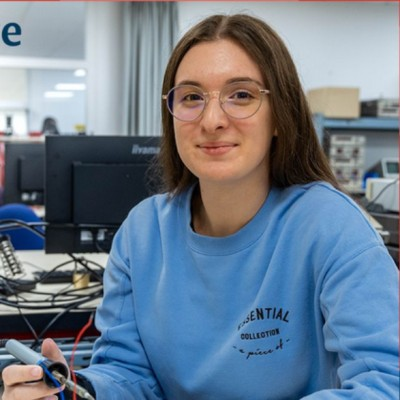
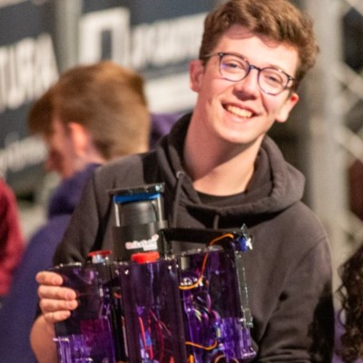

# Contacts des Collaborateurs

 

  Retrouvez ci-dessous la photo d’équipe, puis les profils cliquables des membres du projet et des encadrants.

<!-- PHOTO DE GROUPE -->

  

---

##  Membres du projet

<!-- Max -->

  
  
<a href="javascript:void(0);" onclick="openModal('modal-max')">Max Mallevays</a>

<!-- Roméo -->

  
  
<a href="javascript:void(0);" onclick="openModal('modal-romeo')">Roméo Smagghe</a>

<!-- Iléana -->

  
  
<a href="javascript:void(0);" onclick="openModal('modal-ileana')">Iléana Laurent</a>

---

##  Encadrants du Projet I3

<!-- Adrien -->

  
  
<a href="javascript:void(0);" onclick="openModal('modal-adrien')">Adrien Bracq</a>

<!-- Rémi -->

  
  
<a href="javascript:void(0);" onclick="openModal('modal-remi')">Rémi Lacombe</a>

---

##  Makerspace Amiens

🔗 <a href="https://makerspace-amiens.fr" target="_blank" rel="noopener noreferrer">https://makerspace-amiens.fr</a>

---

<!-- Modales -->

<!-- Max -->

  

    &times;
    <h2>Max Mallevays</h2>
    
<strong>Email :</strong> <a href="mailto:max.mallevays@etu.unilasalle.fr">max.mallevays@etu.unilasalle.fr</a>

  

<!-- Roméo -->

  

    &times;
    <h2>Roméo Smagghe</h2>
    
<strong>Email :</strong> <a href="mailto:romeo.smagghe@etu.unilasalle.fr">romeo.smagghe@etu.unilasalle.fr</a>

  

<!-- Iléana -->

  

    &times;
    <h2>Iléana Laurent</h2>
    
<strong>Email :</strong> <a href="mailto:ileana.laurent@etu.unilasalle.fr">ileana.laurent@etu.unilasalle.fr</a> 
    <a href="mailto:ileana.laurent.80@gmail.com">ileana.laurent.80@gmail.com</a>

    
<strong>LinkedIn :</strong> <a href="https://www.linkedin.com/in/iléana-laurent" target="_blank">Profil LinkedIn</a>

  

<!-- Adrien -->

  

    &times;
    <h2>Adrien Bracq</h2>
    
<strong>Rôle :</strong> Enseignant-chercheur, responsable du Projet I3

    
<strong>Email :</strong> <a href="mailto:adrien.bracq@unilasalle.fr">adrien.bracq@unilasalle.fr</a>

    
<strong>LinkedIn :</strong> <a href="https://www.linkedin.com/in/adrien-bracq-783b54267/" target="_blank">Profil LinkedIn</a>

  

<!-- Rémi -->

  

    &times;
    <h2>Rémi Lacombe</h2>
    
<strong>Rôle :</strong> Étudiant apprenti, assistant encadrant

    
<strong>Email :</strong> <a href="mailto:remi.lacombe@etu.unilasalle.fr">remi.lacombe@etu.unilasalle.fr</a>

    
<strong>LinkedIn :</strong> <a href="https://www.linkedin.com/in/lacombe-r/" target="_blank">Profil LinkedIn</a>

  

<!-- Styles et scripts -->

<!----------------------------------------------------------------------------->

<a class="bouton-suivant" href="../index">Retour à l'Accueil→</a>

<!----------------------------------------------------------------------------->

  

