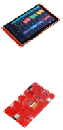
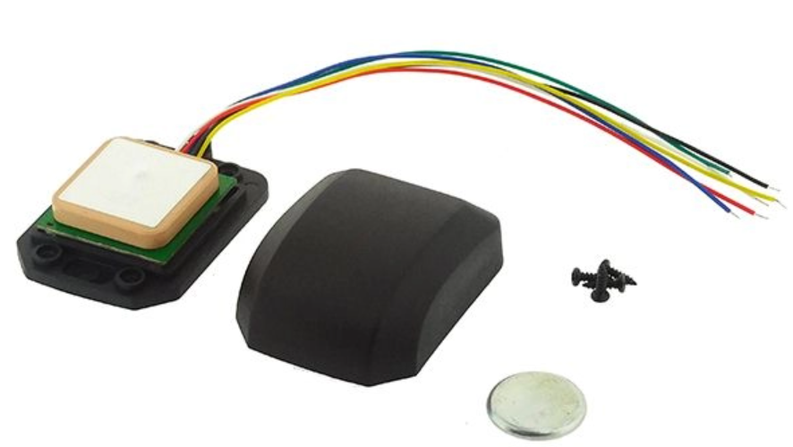
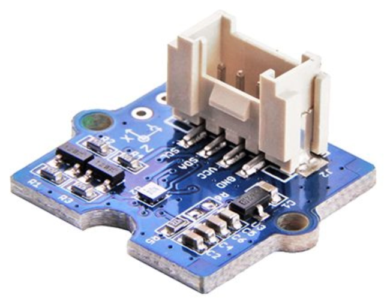

# Composants Électroniques

## Objectif

Rassembler les composants nécessaires pour assurer les trois fonctions essentielles du prototype :

- Acquisition de position GPS   
- Orientation via boussole   
- Affichage graphique clair et interactif 

---

## Liste des composants

<table style="width:100%; border-collapse: collapse; margin-bottom: 2rem;">
  <thead>
    <tr style="background-color:#f0f0f0;">
      <th style="padding: 10px; text-align: left;">Composant</th>
      <th style="padding: 10px; text-align: left;">Référence</th>
      <th style="padding: 10px; text-align: left;">Fonction</th>
    </tr>
  </thead>
  <tbody>
    <tr>
      <td>Microcontrôleur</td>
      <td><strong>ESP32-S3 CrowPanel</strong></td>
      <td>Affichage, GPS, gestion interface</td>
    </tr>
    <tr>
      <td>Écran</td>
      <td>Intégré (7” tactile)</td>
      <td>Interface utilisateur principale</td>
    </tr>
    <tr>
      <td>GPS</td>
      <td><strong>Module TEL0094</strong></td>
      <td>Localisation des points d’eau</td>
    </tr>
    <tr>
      <td>Boussole</td>
      <td><strong>Grove 3-Axis Compass V2</strong></td>
      <td>Orientation / calcul direction</td>
    </tr>
    <tr>
      <td>Batterie</td>
      <td>3.7V Li-ion</td>
      <td>Alimentation autonome (usage ponctuel)</td>
    </tr>
    <tr>
      <td>Divers</td>
      <td>Câbles, connecteurs Grove</td>
      <td>Intégration simple, fiable et modulaire</td>
    </tr>
  </tbody>
</table>

---

## Justification des choix

  

    
<strong>ESP32-S3 CrowPanel</strong> : puissant, compatible Arduino et Micropython, intégrant un écran tactile 7".

    
<strong>Connecteurs Grove</strong> : permettent un câblage modulaire et sécurisé, réduisant les erreurs de branchement.

    
<strong>Modules GPS et Boussole</strong> : éprouvés dans des projets similaires, tous deux compatibles avec l'ESP32.

  

  

     
     
    
  

> Tous les composants ont été choisis pour leur **compatibilité logicielle**, leur **disponibilité** et leur **coût maîtrisé**.

<!----------------------------------------------------------------------------->

<a class="bouton-suivant" href="../5-Conception/conception-3achat">Next→</a>

<!----------------------------------------------------------------------------->

  
  <a href="../12-Contacts/contacts">Contacts</a>

