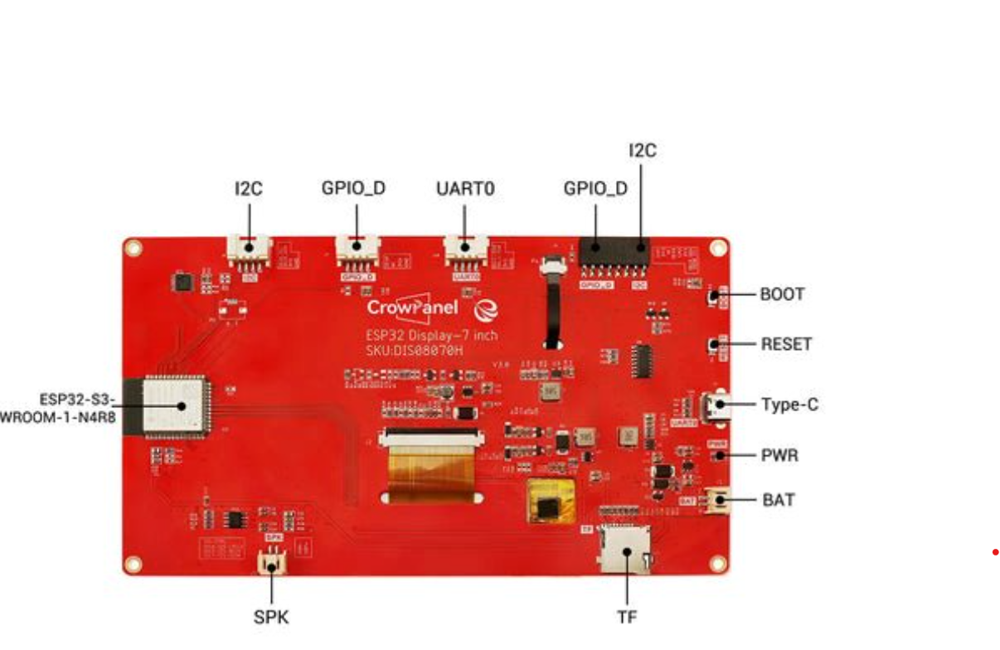

# Electronique

La partie électronique de notre projet a été relativement simple à mettre en place grâce à l'utilisation d'une carte électronique déjà très complète. En effet, nous avons opté pour un écran **Elecrow** équipé d’un **ESP32**, qui répondait parfaitement à l’ensemble de nos besoins pour le développement logiciel. Ce choix stratégique nous a permis de gagner un temps précieux et de nous concentrer davantage sur l’intégration des composants complémentaires nécessaires au bon fonctionnement de notre système.

  

    
    
Modèle sur OnShape – Vue globale

  

  

 
## Choix des Modules Complémentaires

Après avoir validé notre support principal, nous avons recherché les modules nécessaires à notre application. Deux capteurs se sont révélés indispensables :

- **Un module GPS NEO6M**, pour la géolocalisation.
- **Une boussole Grove 3 axes**, pour la détection de l’orientation.

Le module GPS a été choisi après plusieurs recherches en ligne, tandis que la boussole Grove a été sélectionnée en raison de notre expérience préalable avec cette marque lors de travaux pratiques antérieurs.

## Intégration des Composants

- **La boussole** a été connectée via le **bus I²C**, une interface simple et fiable pour ce type de capteur.
- **Le GPS**, quant à lui, devait être câblé sur **l’interface UART0** du microcontrôleur.

Malheureusement, nous avons rencontré des problèmes techniques lors de l’intégration du GPS : dès que ce dernier était connecté, le microcontrôleur cessait de recevoir des données. Ce dysfonctionnement pourrait être lié à un conflit matériel ou une erreur de câblage que nous n’avons pas pu identifier à temps.

## ÉProblèmes lors de l’assemblage final

La veille de la **Journée des Projets**, en procédant à l’assemblage final dans le boîtier, nous avons constaté que la boussole ne fonctionnait plus correctement une fois intégrée. Après analyse, nous suspectons que des **interférences électromagnétiques** entre l’écran et la boussole — qui étaient collés l’un à l’autre — ont perturbé son fonctionnement.

<!----------------------------------------------------------------------------->

<a class="bouton-suivant" href="../6-Prototype/etape-2mod_boitier">Next→</a>

<!----------------------------------------------------------------------------->

  
  <a href="../12-Contacts/contacts">Contacts</a>

