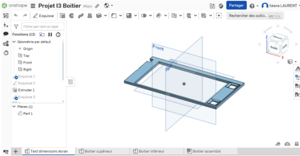

# Modélisation du boitier

## Objectif

Concevoir un boîtier sur mesure pour accueillir l’ensemble des composants électroniques, tout en s’adaptant aux contraintes physiques de l’écran, des capteurs et d’une fixation possible sur une tenue pompier.

---

## Conception sur OnShape

La modélisation 3D du boîtier a été réalisée sur la plateforme en ligne **OnShape**, en intégrant les dimensions précises du CrowPanel, de la batterie et des connecteurs Grove.  
Le boîtier a été conçu en deux parties emboîtables avec emplacements prévus pour des inserts vissés (finalement inutiles grâce à un ajustement parfait).

  

    
    
Modèle sur OnShape – Vue globale

  

  

    
    
Modèle final prêt pour l'impression 3D

  

---

## Étapes de prototypage

  

    <ul style="margin: 0; padding-left: 1.2rem;">
      <li>
        <strong>1er prototype – Découpeuse laser</strong> 
        Réalisé en bois fin. L’espace entre les boutons et les bords était trop réduit, rendant la structure fragile. L’épaisseur insuffisante provoquait des cassures à la manipulation. Ce test a permis d’identifier les zones à renforcer.
      </li>
      <li>
        <strong>2e prototype – Découpeuse laser</strong> 
        Découpe plus nette et épaisse, mais bord de l’écran et zones de bouton trop rigides. Le positionnement nécessitait des ajustements de profondeur. Nous avons alors intégré des <em>congés</em> et une <em>courbure</em> sur OnShape pour mieux épouser la forme des composants.
      </li>
      <li>
        <strong>3e prototype – Impression 3D (test d'ajustement)</strong> 
        Ce prototype a permis de valider l'ensemble des dimensions : écran, boutons, câblage. L'ajustement était bon et les composants s’inséraient correctement. Cela nous a permis de passer à la modélisation complète du boîtier.
      </li>
      <li>
        <strong>4e prototype – Impression 3D (boîtier final raté)</strong> 
        L’impression complète a échoué à cause d’un affaissement lors de l’impression des bords verticaux. Le résultat présentait des irrégularités bloquant l’insertion de l’écran. Cette erreur nous a permis de corriger les points faibles du modèle pour réussir la version finale.
      </li>
    </ul>
  

  

     
     
    
    
Maquettes testées (laser + 3D)

  

---

## Résultat final

  

    
Le boîtier final, imprimé en PLA, s’ajuste parfaitement autour de l’écran tactile et des composants embarqués.  
    Les inserts prévus n’ont finalement pas été nécessaires grâce à un système d’emboîtement précis et solide.

    
Le tout reste démontable, réutilisable, et prêt pour être fixé à une tenue de pompier dans une version ultérieure.

  

  

    
    
Prototype final assemblé

  

---

> Cette modélisation offre une base fiable et réplicable pour une intégration future dans un boîtier certifié anti-feu.

<!----------------------------------------------------------------------------->

<a class="bouton-suivant" href="../6-Prototype/etape-3prog">Next→</a>

<!----------------------------------------------------------------------------->

  
  <a href="../12-Contacts/contacts">Contacts</a>

