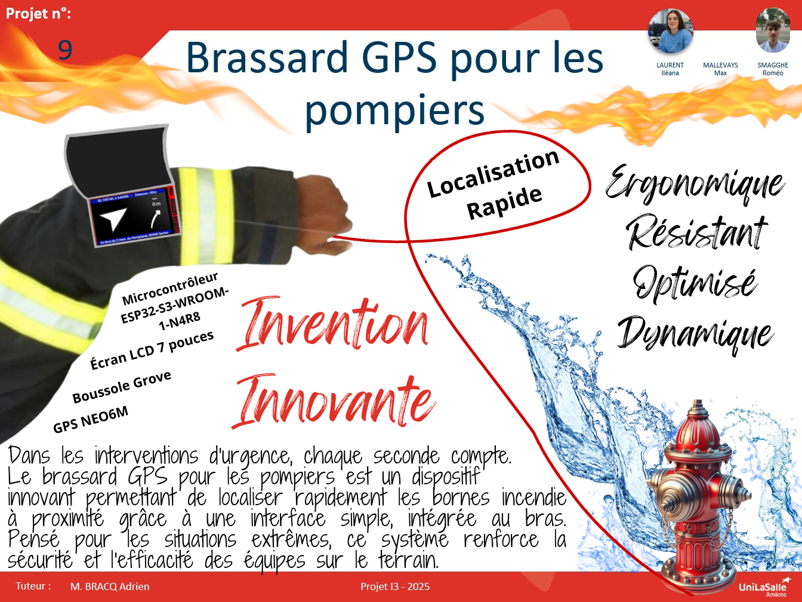
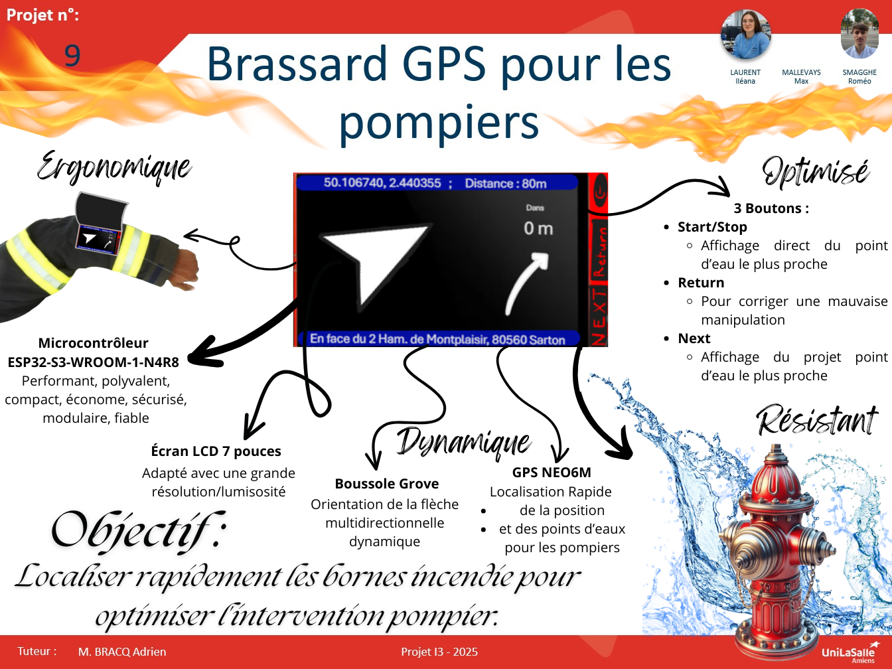

# Poster de Présentation

## Objectif

Le poster synthétise le projet **FirefighterArmband** pour une communication claire lors d’événements publics ou pédagogiques.  
Il a été construit en plusieurs étapes, avec des allers-retours pour améliorer sa lisibilité, son impact visuel et la clarté du message.

---

## Prototype 1

  

    
  

  

    
<strong>Problèmes identifiés :</strong>

    <ul>
      <li>Trop de texte réparti de manière dense</li>
      <li>Absence de hiérarchisation visuelle</li>
      <li>Projet pas suffisamment mis en valeur au centre</li>
    </ul>
  

---

## Prototype 2

  

    
  

  

    
<strong>Évolutions apportées :</strong>

    <ul>
      <li>Meilleure structuration du contenu</li>
      <li>Ajout de visuels techniques</li>
      <li>Mais encore trop d’éléments textuels</li>
    </ul>
  

---

## Poster final

  <a href="../images/Poster9.pdf" target="_blank" style="font-weight: bold; font-size: 1.1em; color: #d62828; text-decoration: underline;">
    ▶️ Télécharger le poster final (PDF)
  </a>
    
  
  
Poster n°9 – utilisé lors de la Journée des Projets

<!----------------------------------------------------------------------------->

<a class="bouton-suivant" href="../7-Supports/supports-2teams">Next→</a>

<!----------------------------------------------------------------------------->

  
  <a href="../12-Contacts/contacts">Contacts</a>

