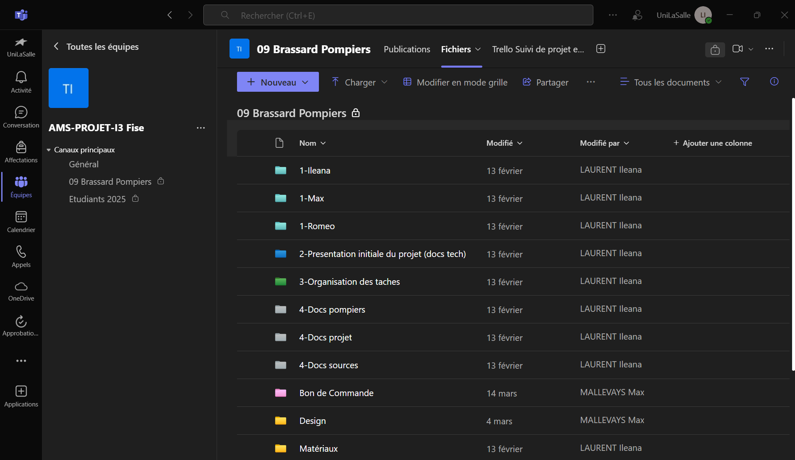
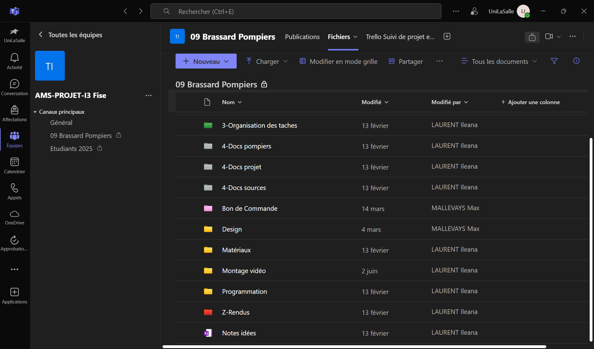

# Organisation via Microsoft Teams

## Objectif

Faciliter la collaboration entre les membres du groupe tout au long du projet, centraliser les documents, échanger les informations importantes, et structurer l’espace de travail de manière claire dès le départ.

---

## Mise en place initiale

Dès le lancement du projet, nous avons créé un canal dédié dans Microsoft Teams.  
Nous y avons organisé des dossiers thématiques correspondant aux principales étapes du projet (études, conception, supports, planning...) afin d’anticiper et structurer nos échanges.

---

## Utilisation concrète

- Stockage et partage de documents en temps réel (fichiers techniques, supports, visuels)
- Transmission rapide d’informations clés (décisions, rendus, tâches urgentes)
- Centralisation des contributions de chacun
- Suivi structuré de l’avancement dans les dossiers partagés

---

## Extraits de notre organisation Teams

  

    
    
Vue sur l’interface principale du canal

  

  

    
    
Structure de nos dossiers partagés

  

---

## Bilan

Cette plateforme a constitué notre **base de communication** durant tout le projet.  
Son accessibilité, sa synchronisation avec les outils Microsoft, et sa capacité à centraliser tous les fichiers ont grandement facilité notre travail.

> L’organisation anticipée de notre Teams a été un facteur clé dans la fluidité de la collaboration.

<!----------------------------------------------------------------------------->

<a class="bouton-suivant" href="../7-Supports/supports-3trello">Next→</a>

<!----------------------------------------------------------------------------->

  
  <a href="../12-Contacts/contacts">Contacts</a>

