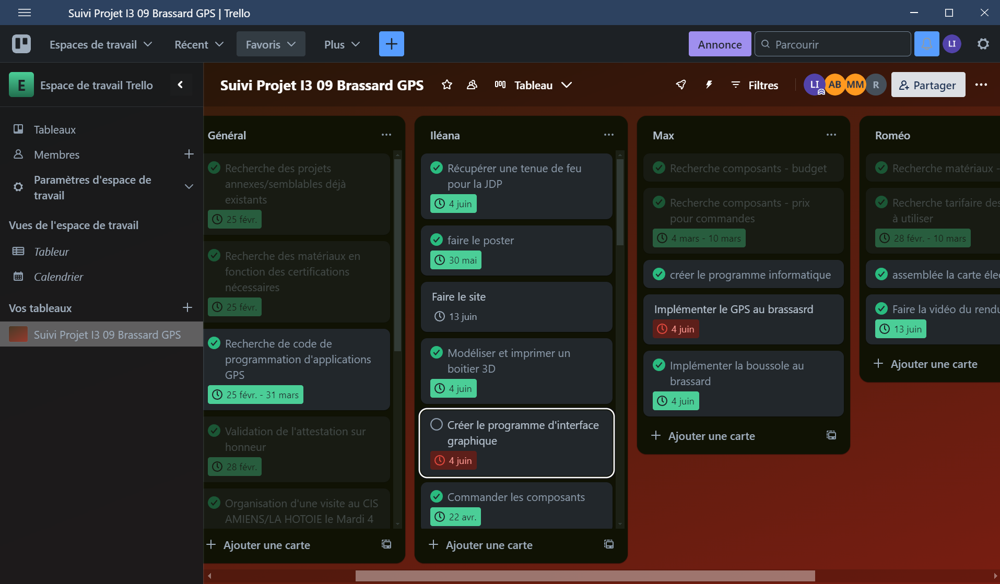

# Suivi des tâches et gestion du projet

## Objectif

Assurer un suivi clair de l’avancement des différentes étapes du projet, répartir les tâches entre les membres de l’équipe, et planifier efficacement les rendus.

---

## Méthode initiale

Au départ, nous avons utilisé un document Word partagé contenant un tableau avec les tâches, les personnes assignées, les échéances et les statuts.  
Ce système, bien qu'efficace au début, montrait vite ses limites en termes de lisibilité, de mise à jour collaborative et de visualisation globale.

---

## Découverte de Trello

  

    
Notre enseignant nous a présenté l’outil <strong>Trello</strong>, une solution en ligne dédiée à la gestion visuelle de projet par cartes et colonnes.  
    Ce logiciel s’est avéré parfaitement adapté à notre fonctionnement en groupe et à la structure agile du projet FirefighterArmband.

    <ul>
      <li>Suivi clair et en temps réel</li>
      <li>Visualisation des tâches par statut (À faire / En cours / Terminé)</li>
      <li>Répartition simple entre les membres</li>
      <li>Possibilité de commenter, documenter et prioriser</li>
    </ul>
  

  

    
    
Extrait du tableau Trello utilisé pour ce projet

  

---

## Bilan

L’adoption de Trello nous a permis de professionnaliser notre organisation et de mieux répartir la charge de travail.  
Il a également servi de support de communication entre les membres du groupe et de preuve de l’avancement auprès de l’enseignant.

> Cet outil s’est révélé particulièrement efficace dans le cadre d’un projet pédagogique court (75h) à livrables multiples.

<!----------------------------------------------------------------------------->

<a class="bouton-suivant" href="../7-Supports/supports-4GitHub">Next→</a>

<!----------------------------------------------------------------------------->

  
  <a href="../12-Contacts/contacts">Contacts</a>

