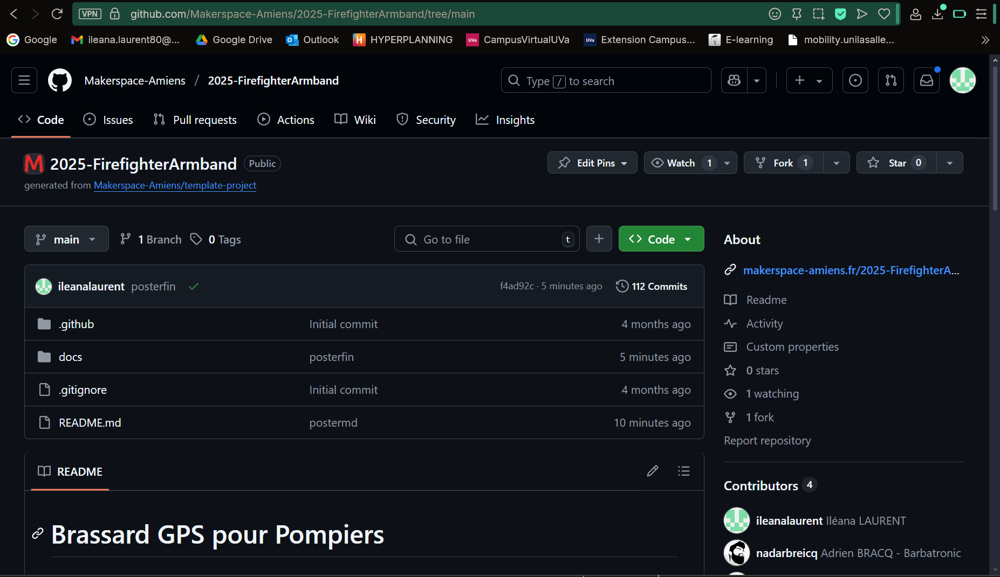

# Dépôt GitHub 

## Objectif

Utiliser GitHub comme espace de centralisation du code, de la documentation et de l’hébergement du site web via GitHub Pages.

---

## Difficultés rencontrées

Pendant plusieurs semaines, nous avons rencontré de nombreux problèmes lors de la tentative de modification du dépôt :

- **Push non pris en compte**, erreurs de déploiement, ou simple absence de mise à jour du site malgré les modifications envoyées
- Aucune expérience préalable sur GitHub dans notre groupe
- Problèmes de branche, de validation ou de mauvais timing avec GitHub Pages

---

## Intervention et résolution

Grâce à l’aide précieuse de <strong><a href="https://www.linkedin.com/in/clémence-l-558360282/" target="_blank" rel="noopener noreferrer">Mlle Clémence LELEU</a></strong> (étudiante d’un autre groupe), qui disposait d’une bonne expérience sur GitHub :

- Nous avons été accompagnés dans la compréhension du fonctionnement du **dépôt distant**
- Elle nous a recommandé l’outil **github.dev** : une interface en ligne accessible directement depuis le navigateur avec `.` sur le dépôt
- Nous avons appris à <strong>travailler proprement</strong> sur le dépôt, à commiter, à push correctement et à surveiller les erreurs éventuelles

Cela a marqué un vrai tournant dans notre organisation technique.

---

## Aperçu de notre dépôt

  
  
Aperçu du dépôt GitHub du projet

---

## Bilan

Bien que le démarrage ait été laborieux, GitHub a fini par devenir un outil de travail efficace et fiable, à condition de comprendre sa logique.  
L’usage de **github.dev**, l’accès à la documentation officielle, et l’aide d’une étudiante expérimentée nous ont permis d’en tirer pleinement parti.

> Cette expérience nous a permis de monter en compétence sur un outil incontournable du développement collaboratif.

<!----------------------------------------------------------------------------->

<a class="bouton-suivant" href="../7-Supports/supports-5site">Next→</a>

<!----------------------------------------------------------------------------->

  
  <a href="../12-Contacts/contacts">Contacts</a>

