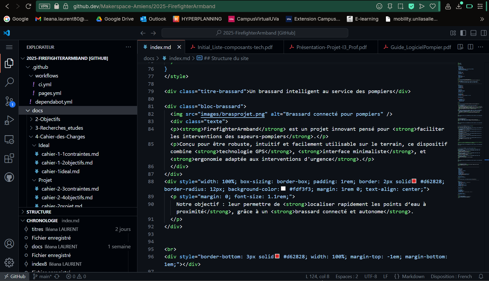

# Création du Site Web

## Objectif

Centraliser toutes les informations du projet **FirefighterArmband** dans une interface claire, technique, consultable en ligne, afin de faciliter sa compréhension, sa présentation et sa reproduction.

---

## Contexte de création

Le site n’a pu être créé qu’après avoir résolu les problèmes liés à la modification du dépôt GitHub.  
En effet, pendant plusieurs semaines, nos tentatives de mise à jour échouaient : push non pris en compte, erreurs silencieuses, ou site non actualisé.

Grâce à l’usage de **github.dev**, une interface d’édition directement accessible via navigateur, nous avons enfin pu intervenir sur les fichiers du dépôt et **déployer un site fonctionnel via GitHub Pages**.

---

## Fonctionnalités du site

- Organisation du contenu en sections thématiques : recherches, cahier des charges, conception, tests, supports
- Ajout de styles personnalisés pour une lecture claire et technique
- Affichage d’illustrations, de schémas, et de visuels du prototype
- Navigation simplifiée par menu latéral (architecture type documentation technique)

---

## Aperçu de la programmation du site

  
  
Site de documentation créé via GitHub Pages

---

## Bilan

Ce site constitue la **forme finale et complète** du projet. Il regroupe tous les éléments nécessaires à sa compréhension et à sa reproduction.  
Accessible publiquement, il peut être utilisé comme support technique, vitrine de compétences ou démonstrateur pédagogique.

> L’expérience acquise lors de sa mise en place nous a permis de découvrir concrètement les outils de documentation web open source.

<!----------------------------------------------------------------------------->

<a class="bouton-suivant" href="../7-Supports/supports-6video">Next→</a>

<!----------------------------------------------------------------------------->

  
  <a href="../12-Contacts/contacts">Contacts</a>

