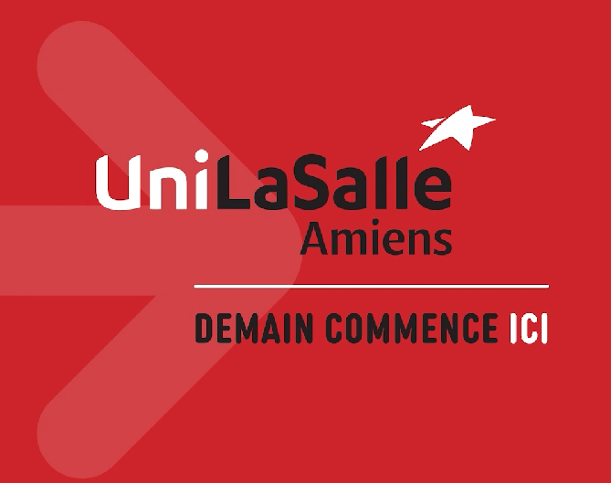

# Vidéo de Présentation

## Objectif

Présenter le projet **FirefighterArmband** de manière claire et dynamique à travers une courte vidéo.  
Elle permet d’en visualiser les fonctionnalités, la conception, le prototype, et de comprendre les choix réalisés, en complément du site et du poster.

---

## Consignes respectées

- Durée : **moins de 1min30**
- Introduction du contexte et des objectifs
- Présentation du fonctionnement du dispositif
- Vues du **prototype physique** et de l’**interface logicielle**
- Plans explicatifs du fonctionnement global
- Conclusion claire et synthétique
- Stockée localement (poids < 50 Mo)

---

## Vidéo

La vidéo étant trop volumineuse pour GitHub Pages (124 Mo), elle est hébergée sur Google Drive.

  

  <a href="https://drive.google.com/file/d/1uaQsOHQRo6gNZOQUum38T-cCwVlf8Z7x/view?usp=sharing"
     target="_blank"
     style="display: inline-block; background-color: #d62828; color: white; padding: 12px 24px; border-radius: 8px; font-weight: bold; text-decoration: none; box-shadow: 0 4px 12px rgba(0,0,0,0.15);">
    ▶️ Voir la vidéo de présentation sur Google Drive
  </a>

> N'hésitez pas à activer le plein écran sur Google Drive pour un meilleur confort de visionnage.

---

## Remarques

Cette vidéo peut être utilisée en tant que :
- Support visuel lors de soutenances ou présentations publiques
- Aperçu rapide du projet pour des recruteurs ou visiteurs
- Démonstration intégrée dans un portfolio ou dossier technique

> Le ton est volontairement pédagogique et synthétique, à l’image du projet.

<!----------------------------------------------------------------------------->

<a class="bouton-suivant" href="../8-Retour/retour">Next→</a>

<!----------------------------------------------------------------------------->

  
  <a href="../12-Contacts/contacts">Contacts</a>

