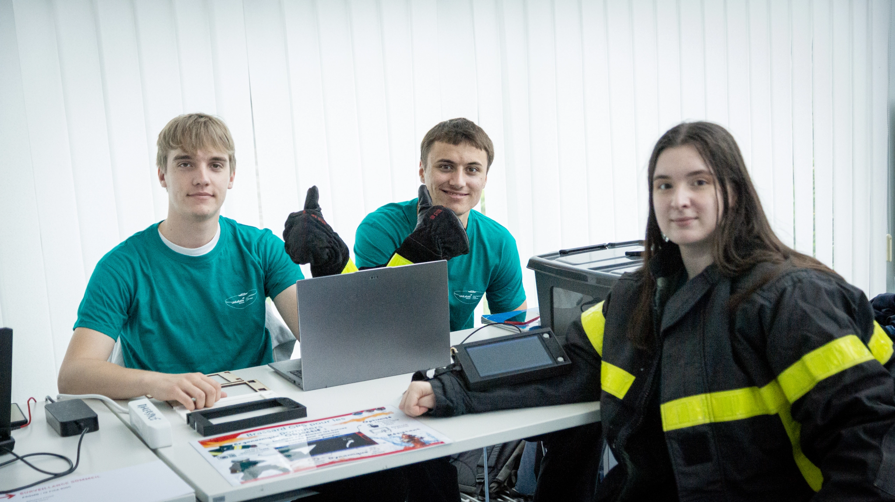

#  Retour sur la Journée des Projets – 4 juin 2025

La **Journée des Projets** a constitué une étape importante pour présenter et évaluer notre brassard électronique destiné aux pompiers.  
Cet événement, organisé le **mercredi 4 juin 2025**, a rassemblé enseignants, étudiants et invités extérieurs, venus découvrir les solutions techniques développées dans le cadre de la matière **Projet I3**.

---

## Présentation devant le jury

Pendant cette journée, nous avons présenté notre prototype à un **jury composé principalement de nos enseignants**, mais également à d’autres visiteurs intéressés par les applications concrètes de nos projets.  
Cette session a été l’occasion de valoriser le travail fourni tout au long du semestre et de démontrer nos compétences en conception et en développement.

Nous avons détaillé :

- Le **contexte** et les **objectifs** du brassard,
- Le **fonctionnement général** du système,
- Le **choix des composants** : microcontrôleur **ESP32**, écran **TFT**, module **GPS**, alimentation autonome,
- Les **contraintes spécifiques** liées à l’utilisation par des pompiers (robustesse, faible consommation, lisibilité).

---

## Déroulé de la démonstration

La démonstration a suivi une structure claire pour mettre en valeur chaque aspect du projet :

- **Présentation du contexte et de l’objectif** : nous avons rappelé les besoins des pompiers en matière de localisation en intervention, et expliqué comment notre brassard pourrait s’intégrer directement à la **tenue de feu** sans gêner les mouvements ni alourdir l’équipement.

- **Présentation du prototype** : nous avons détaillé les choix techniques pour garantir la robustesse et la fiabilité, en insistant sur le choix de l’**ESP32**, du module **GPS**, de l’**écran TFT** et de l’alimentation embarquée.

- **Explication de l’électronique embarquée** : nous avons expliqué comment les différents modules communiquent entre eux, comment les données GPS sont traitées en temps réel, et comment les calculs de distance sont réalisés pour fournir une information claire et actualisée.

- **Présentation de la programmation et de l’interface** : nous avons montré l’interface conçue pour être lisible même dans des conditions extrêmes : position actuelle affichée en temps réel, destination fixe et distance restante. L’interface a été pensée pour une **consultation rapide**, sans interaction complexe, afin que le pompier puisse se concentrer sur sa mission.

Cette démonstration a illustré la **logique de conception** : un brassard simple, fonctionnel, et directement adaptable à l’équipement des pompiers tout en répondant aux contraintes techniques d’un environnement exigeant.

## Bilan et échanges

À l’issue de la démonstration, nous avons échangé avec le jury et les visiteurs pour recueillir leurs impressions et suggestions.  
Ces retours ont mis en avant :

- L’intérêt concret du projet pour améliorer la sécurité en intervention,
- Des idées d’améliorations comme l’intégration de modules de communication plus robustes,
- L’optimisation de la batterie pour prolonger l’autonomie,
- Des pistes pour rendre l’interface encore plus ergonomique, même avec des gants.

La **Journée des Projets** a ainsi validé la cohérence de notre solution et ouvert des perspectives pour de futures améliorations.

---

<!----------------------------------------------------------------------------->

<a class="bouton-suivant" href="../8-Retour/retour-2difficultes">Next→</a>

<!----------------------------------------------------------------------------->

  
  <a href="../12-Contacts/contacts">Contacts</a>

