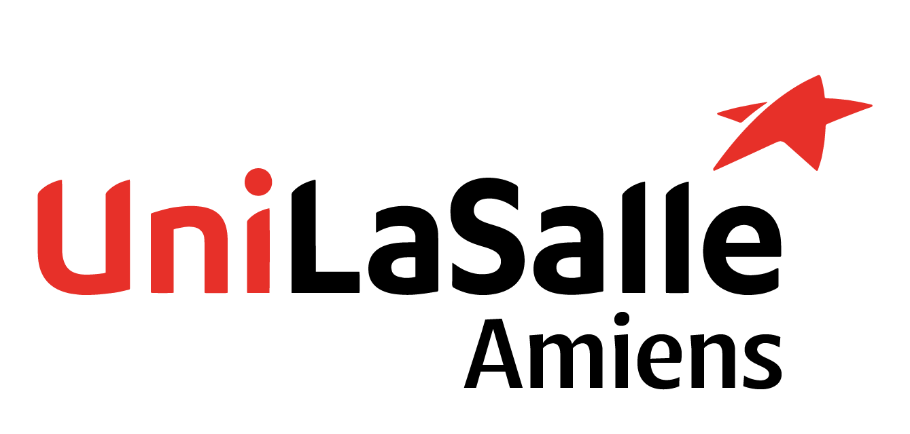

# Remerciements

 

Ce projet n'aurait jamais pu voir le jour sans l'aide, le soutien et l'engagement de nombreuses personnes. Nous tenons ici à exprimer toute notre gratitude à celles et ceux qui nous ont accompagnés tout au long de cette aventure.

---

### Nos collaborateurs

Nous remercions chaleureusement l’ensemble de nos **camarades de classe** pour leur implication, leurs retours constructifs et leur soutien.  
Nos remerciements vont tout particulièrement à **nos enseignants encadrants**, dont vous trouverez les noms dans l’onglet [Contacts](./contacts.html). Leur expertise, leur écoute et leur accompagnement ont été des atouts déterminants pour structurer notre démarche, approfondir notre compréhension et donner de la cohérence à notre travail.

---

### Mlle LELEU Clémence

Nous tenons à remercier **Mlle LELEU Clémence** pour son accueil, ses échanges et l’inspiration apportée par son propre projet.  
Son travail, à la fois technique et abouti, a représenté une référence concrète dans notre réflexion.  
Son projet est accessible à l’adresse suivante :  
[https://makerspace-amiens.fr/2025-BipedRobot/](https://makerspace-amiens.fr/2025-BipedRobot/)

---

### Adjudant-chef RADKE Robert

Nos remerciements les plus sincères vont à **l’Adjudant-chef RADKE Robert**, pompier professionnel et précieux appui tout au long du projet. Son implication a largement dépassé nos attentes. Il a notamment :

- Organisé plusieurs présentations sur les missions et contraintes du métier de pompier.
- Pris le temps de répondre à toutes nos questions avec précision.
- Mis à notre disposition une **tenue de feu professionnelle**, utilisée pour notre présentation à la **Journée des Projets**.
- Facilitée la prise de contact avec des **officiers supérieurs**.
- Fait tout son possible pour nous aider à obtenir :
  - **Le logiciel de localisation des points d’eau** utilisé par les pompiers, que nous souhaitions intégrer au brassard.
  - Une **veste de feu** pour réaliser des tests concrets d’intégration.

Son engagement personnel et professionnel a été un soutien inestimable pour donner au projet une dimension réaliste et pertinente.

---

### L'école

Enfin, nous remercions **l'école** pour l’attribution d’un **budget de 250 €**, dont environ **120 €** ont été utilisés pour la fabrication de notre **premier prototype**.  
Ce soutien financier nous a permis d’acquérir les composants nécessaires et de mener à bien la première phase de développement du dispositif.

---

Grâce à ces soutiens variés et précieux, ce projet a pu se concrétiser dans les meilleures conditions possibles.

<!----------------------------------------------------------------------------->

<a class="bouton-suivant" href="../10-Conclusion/conclusion">Next→</a>

<!----------------------------------------------------------------------------->

  
  <a href="../12-Contacts/contacts">Contacts</a>

