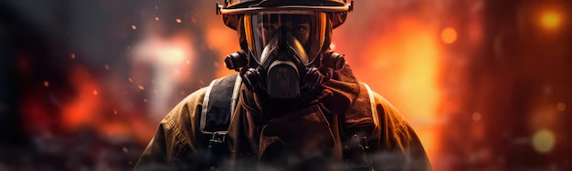
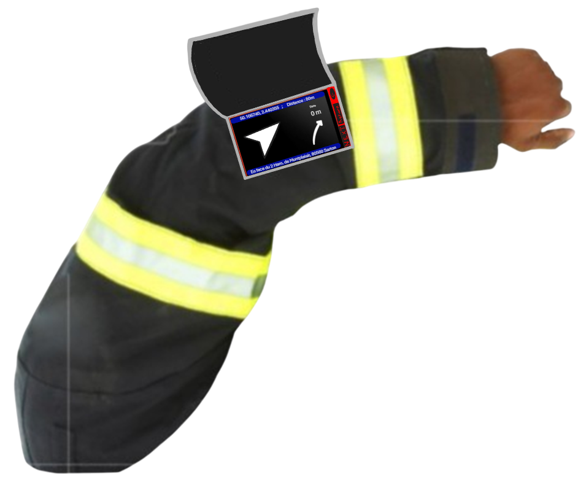

FirefighterArmband

Brassard localisant les points d'eaux pour les pompiers

---

Un brassard intelligent au service des pompiers

  
  

    
<strong>FirefighterArmband</strong> est un projet innovant pensé pour <strong>faciliter les interventions des sapeurs-pompiers</strong>.

    
Notre objectif : leur permettre de <strong>localiser rapidement les points d’eau à proximité</strong>, grâce à un <strong>brassard connecté et autonome</strong>.

    
Conçu pour être robuste, intuitif et facilement utilisable sur le terrain, ce dispositif combine <strong>technologie GPS</strong>, <strong>interface minimaliste</strong>, et <strong>ergonomie adaptée aux interventions d'urgence</strong>.

  

---

## Accès aux supports

- [Voir le poster du projet](7-Supports/supports-1poster.md)
- [Regarder la vidéo de présentation](7-Supports/supports-6vidéo.md)

---

## Structure du site

Vous trouverez dans les différentes sections :
- Le cahier des charges initial et idéal
- Les contraintes techniques
- Le dossier technique (matériel, logiciel)
- Les tests et prototypes
- Les supports de présentation (poster, vidéo)

> Ce site vise à fournir une documentation claire, complète et structurée pour comprendre et reproduire le projet dans un cadre professionnel ou pédagogique.

---

## À qui s'adresse ce projet ?

- Aux **services de secours** souhaitant intégrer des outils innovants
- Aux **étudiants en ingénierie** intéressés par les projets embarqués
- Aux **makers** passionnés par l’électronique et la sécurité publique

---

--> **Naviguez via le menu latéral** pour explorer chaque partie du projet.  
Bonne découverte !

